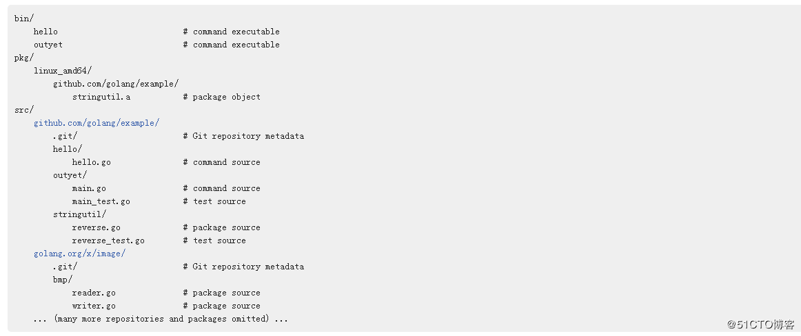

##下载  
####官网下载地址如下：  
https://golang.org/dl/  
####我们可以选择自己操作系统的安装包进行下载并且安装，这里就不再赘述  
  
##环境变量  
golang对环境变量有一定的要求，  
首先需要配置环境变量GOROOT，假设你的go安装路径为 C:\go，则此路径为GOROOT的值  
然后还需要在PATH变量里配置go安装目录下的bin目录，即C:\go\bin。也可以引用GOROOT变量，如%GOROOT%\bin，配置了该值后才能直接执行go相关的命令。  
最后一项是GOPATH，这个很重要很多人被坑在这。go和其他语言不一样十分依赖于工作目录，即GOPATH所指向的目录。比如我建立了三个目录：golib、gowork、gotest（虽然官方建议 “Go programmers typically keep all their Go code in a single workspace.”）  
在配置GOPATH的时候就需要有这三个目录的路径，并且把golib放在第一个。这三个目录中的又要分别有bin、pkg、src 三个文件夹，这才算一个标准的工作目录，一张截图作为参照：  
  
  
go的这种模式决定了你不能按照版本控制工具来作为代码的根目录，也不能随意的将某一个测试项目建立到随意的路径下，因为工作目录必须都在GOPATH所指向的路径中。  
